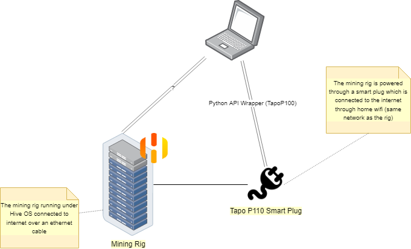

# Rig smart switcher
A python script that automatically switches ON/OFF a crypto mining rig depending on the weather and rig temp.

# TODO's
- [ ] Look for and test hiveOS API
- [x] Config file + validation
- [ ] Use [Cement](https://docs.builtoncement.com/getting-started/beginner-tutorial/part-1-creating-your-first-project) ? 